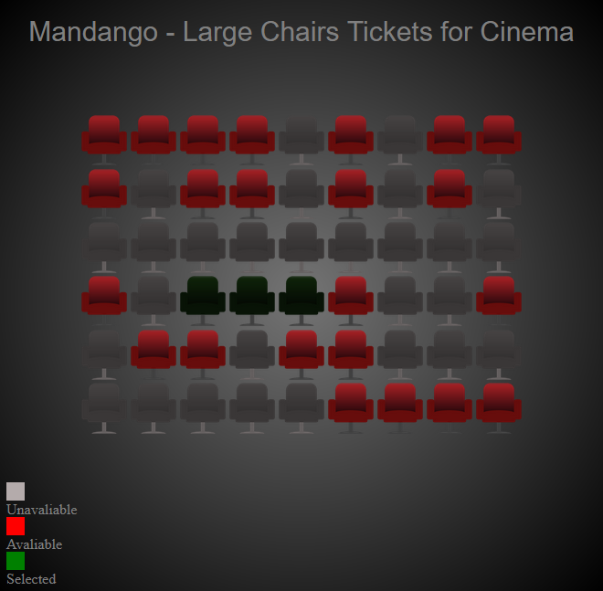

# Mandango - Tickets para cinema

 => Exercício extraído do livro "Use a Cabeça - Javascript"

​		Utilizando principio de arrays unidimensionais e bidimensionais, a idéia é que Mandango (o personagem do exercício) desejava criar um código para verificar cadeiras de cinema onde tivessem 3 cadeiras em sequência livres, para ter mais espaço, ao invés de um colado no outro (a idéia também custaria mais caro por reservar 3 cadeiras pra essa finalidade).

​		O código javascript começou a princípio verificando cadeiras livres e ocupadas (true e false) em uma única fileira. Logo após, possibilitando a marcação de um assento livre (fazendo a reserva).

​		Após fazer a busca em uma única fileira, expandimos o código para verificar várias fileiras, e em seguida, procurar pela sequência de 3 cadeiras livres em sequência, ao encontrar, pede uma confirmação para aceitar essas 3 cadeiras ou não. Se aceitas, finaliza-se o código dispondo o restante das cadeiras com o estado em que se encontram. Se recusando, retoma a busca até que aceite ou finalize todas as cadeiras e todas fileiras.

<u>***CONCEITOS DESENVOLVIDOS:***</u>

* Loop for
* Array unidimensional
* Arrays bidimensionais
* Interrupção de loop com break
* Funções
* Decomposição do desafio geral em pequenas partes utilizando funções

